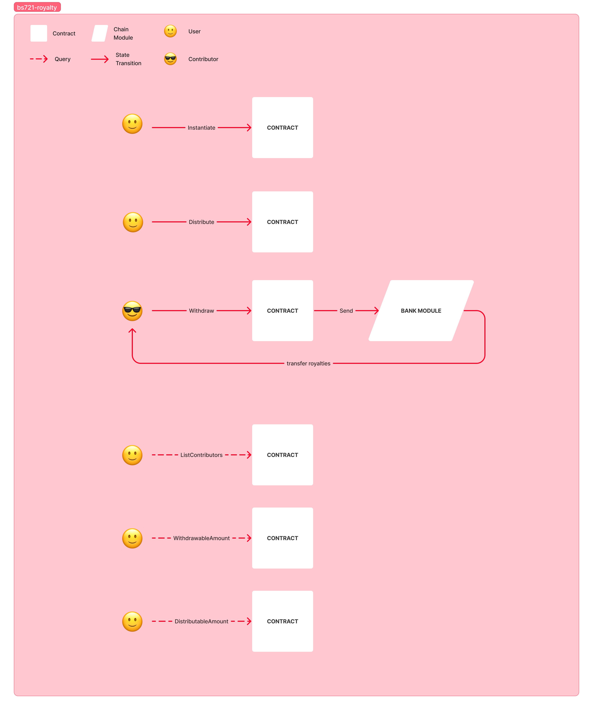

# BS721 Royalties

This contract allows for the distribution of its balance to a list of contributors proportionally based on their shares.

The flowchart below describes the components of the contract and how they interact:

## Instantiate

Contract instantiation requires the specification of two types:

* `denom`: the native token denom used as contract royalties.
* `contributors`: the list of contributors that will participate in royalties distributions.

Each contributor is described by a custom type, `ContributorMsg`, composed by:

* `address`: the address of the contributor.

* `role`: the role of the contributor. This field cannot be left empty but can be passed an empty string.

* `shares`: shares associated to the contributor. This value is used to compute the total shares by summing the shares field of each ContributorMsg. The percentage of royalties associated with each contributor is then determined based on their shares.

## Execute

The contract handles two possible state-changing messages:

* `Distribute`: this messages causes the contract to distribute royalties proportionally among contributors. This logic can result in error if there are not enough tokens to be distributed.Distributed royalties are not sent directly to contributors but are stored as a field within the contract's state. Any user can send this message.

* `Withdraw`: this message can be sent only by a contributor and results in a `BankMsg` to send the accrued royalties to the sender.

## Query

Below the list of queries that can be resolved by the contract is reported:

* `ListContributors`: allows to retrieve information associated with each contributor.

* `WithdrawableAmount`: returns the sum of the royalties all contributors can withdraw.

* `DistributableAmount`: returns the difference between the contract's balance and the number of tokens that can be withdrawn as royalties.

## License

This project is licensed under the Apache License - see the LICENSE-APACHE file for details.
